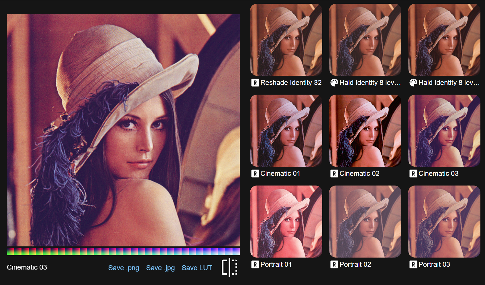

# LUT Web Previewer



Allows previewing LUT files in the browser, using either HaldCLUT or Unwrapped 3D cubes (such as those used by ReShade).

## LUT Formats

### HaldCLUT


A series of points, in increasing order of B G R values.

Generate the above identity HaldCLUT images using ImageMagick:

```bash
# 12-level sRGB HaldCLUT
magick convert hald:12 -depth 16 -colorspace sRGB "Hald Identity 12 level 16 bit.png"
# 12-level RGB HaldCLUT
magick convert hald:12 -depth 8 -colorspace RGB "Hald Identity 12 level 8 bit.png"

# 8-level sRGB HaldCLUT
magick convert hald:8 -depth 16 -colorspace sRGB "Hald Identity 8 level 16 bit.png"
# 8-level RGB HaldCLUT
magick convert hald:8 -depth 8 -colorspace RGB "Hald Identity 8 level 8 bit.png"
```

### Unwrapped Cube


A .cube file with the z dimension flattened into a strip of squares.
In each square, X axis is the R value, Y axis is the G value, and each sequential square represents the Z axis for the B value.

## Development

Run `ng serve` for a dev server. Navigate to `http://localhost:4200/`. The app will automatically reload if you change any of the source files.

## Build

Run `ng build` to build the project. The build artifacts will be stored in the `dist/` directory.
